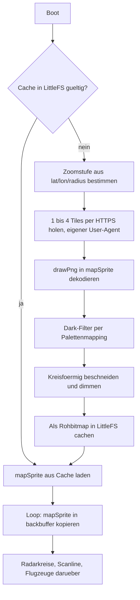

# OSM Dark-Map als Radar-Hintergrund

## Zielhardware

- MCU: ESP32-S3FH4R2 (ESP32-S3 Mini), 4 MB Flash und 2 MB QSPI-PSRAM im Chippaket, 512 KB internes SRAM
- Display: AZDelivery GC9A01, 1,28 Zoll rund, 240x240, 4-Draht-SPI, **3,3 V** für Logik und Versorgung
- Eingabe: KY-040 Drehencoder, WS2812-Status-LED auf dem Board

Das Speicherbudget geht damit auf: Karten-Sprite und Backbuffer je 240 * 240 * 2 = 115 KB, zusammen 230 KB in den 2 MB PSRAM, plus rund 45 KB Heap für TLS beim Tile-Download im internen SRAM.

## Ausgangslage und die drei Vorbedingungen

Drei Dinge müssen vor dem eigentlichen Feature geradegezogen werden, sonst funktioniert es prinzipiell nicht. Zwei davon sind mit Schritt 1 und 2 erledigt, die dritte steht noch aus.

**PSRAM wurde nicht initialisiert.** *(erledigt in Schritt 1)* Der FH4R2 hat 2 MB QSPI-PSRAM, aber [platformio.ini](platformio.ini) setzte nur `-DBOARD_HAS_PSRAM`, ohne den Speichertyp zu deklarieren. Das `esp32-s3-devkitc-1`-Profil geht per Default von Octal-PSRAM aus, was auf diesem Chip in einem `PSRAM ID read error` endet. Ohne PSRAM gibt es keinen Platz für zwei 16-Bit-Sprites. Ob es jetzt greift, sagt die Boot-Diagnose aus Schritt 2 — das ist noch nicht auf Hardware verifiziert.

**Die Hintergrundbeleuchtung war abgeschaltet.** *(erledigt in Schritt 2)* [include/LGFX.h](include/LGFX.h) setzte `cfg.pin_bl = -1`, das AZDelivery-Modul hat aber einen BLK-Pin, der angesteuert werden muss. Bleibt er offen, ist das Display dunkel.

**Die aktuelle Projektion ist nicht kartenkompatibel.** *(offen, siehe Schritt 3 und 8)* `AircraftManager::ProjectCoordinateToScreen` rechnet äquidistant und ohne cos(lat)-Korrektur:

```370:381:src/AircraftManager.cpp
std::pair<int, int> AircraftManager::ProjectCoordinateToScreen(float predLat, float predLon) const
{
    const float dLon = predLon - lon;
    const float dLat = predLat - lat;

    const float normLon = (dLon + rad) / (2.0f * rad);
    const float normLat = (dLat + rad) / (2.0f * rad);
```

Auf 52 Grad Nord ist das Bild damit horizontal um Faktor 1/cos(52 Grad) = 1,62 gestreckt. Kartentiles sind Web Mercator. Ohne Umstellung würden Flugzeuge um bis zu 60 Prozent neben ihrer Position auf der Karte liegen. Die Umstellung ist gleichzeitig ein Bugfix, verschiebt aber sichtbar die Flugzeugpositionen.

## Datenfluss



## Schritt 1: Board-Konfiguration — erledigt

[platformio.ini](platformio.ini) enthält jetzt die für den FH4R2 dokumentierten Werte:

```ini
board_upload.maximum_size = 4194304
board_build.arduino.memory_type = qio_qspi
board_build.flash_mode = qio
board_build.psram_type = qio
board_build.filesystem = littlefs
```

`huge_app.csv` bleibt: 3 MB App plus eine 896 KB grosse Datenpartition (`spiffs, 0x310000, 0xE0000`) — mehr als genug für den 115 KB grossen Cache. `monitor_port`/`upload_port` sind entfernt, PlatformIO erkennt den Port selbst; der harte `COM16` steht nicht mehr im Repo.

Der bisher fest verdrahtete `#define RGB_LED_PIN 21` aus [src/main.cpp](src/main.cpp) ist als Build-Flag `-DRGB_LED_PIN=21` hinterlegt. "ESP32-S3 Mini" ist kein eindeutiges Produkt: je nach Hersteller sitzt die WS2812 auf GPIO21, GPIO47 oder GPIO48. Als Flag ist das eine Zeile in der `platformio.ini` statt einer Codeänderung, falls die LED dunkel bleibt. Die Status-LED ist rein kosmetisch, blockiert also nichts.

Abweichung: das `#define` in `main.cpp` wurde nicht gelöscht, sondern in einen `#ifndef`-Block gesetzt. Damit bleibt die Datei auch ohne das Build-Flag übersetzbar, das Flag gewinnt aber, wenn es gesetzt ist.

## Schritt 2: Display-Bring-up — erledigt

**Backlight per PWM.** In [include/LGFX.h](include/LGFX.h) ist der `Light_PWM`-Block scharf geschaltet:

```cpp
auto cfg = _light.config();
cfg.pin_bl = 1;          // BLK des GC9A01
cfg.freq   = 12000;
cfg.pwm_channel = 7;
cfg.invert = false;
```

GPIO1 ist auf dem FH4R2 frei und PWM-fähig. Belegt sind bereits GPIO2 bis GPIO6 für das Display und GPIO7 bis GPIO9 für den Encoder; GPIO33 bis GPIO37 sind beim FH4R2 tabu, weil dort das interne PSRAM hängt. Damit lässt sich die Helligkeit über `tft.setBrightness(0..255)` regeln, was gut zur Karten-Dimmung passt: die dunkle Karte bestimmt den Kontrast im Bild, die Beleuchtung die absolute Helligkeit im Raum.

In `setup()` wird die Helligkeit nach `tft.init()` auf die Konstante `DEFAULT_BACKLIGHT` (255) gesetzt. Die ist der Anknüpfungspunkt für den `backlight`-Slider aus Schritt 9. Die beiden auskommentierten Zeilen `pinMode(3, OUTPUT)` / `digitalWrite(3, HIGH)` sind bei der Gelegenheit entfallen.

**Boot-Diagnose.** `PrintBootDiagnostics()` in [src/main.cpp](src/main.cpp) gibt Chipmodell, Revision, Kernzahl, Flash-, PSRAM- und Heap-Größe aus und warnt explizit, wenn PSRAM 0 meldet. Dann ist die Konfiguration aus Schritt 1 nicht angekommen — das ist der Punkt, an dem das Feature sonst still scheitert.

Abweichung: statt des auskommentierten `delay(1000)` wartet `setup()` jetzt maximal 1 Sekunde auf den USB-CDC-Host und bricht ab, sobald er da ist. Ohne das schluckt CDC die Diagnose beim ersten Boot regelmäßig. Preis: hängt das Gerät an einer reinen Stromquelle ohne Terminal, kostet jeder Boot eine zusätzliche Sekunde. Bei einem Gerät, das danach ohnehin auf WiFi wartet, vertretbar — falls störend, ist die Schleife eine Zeile.

**Verdrahtung korrigieren.** Die Tabellen in [README.md](README.md) führten VCC auf 5 V. Das AZDelivery-Modul ist mit 3,3 V spezifiziert, Logik und Versorgung. Beide Tabellen stehen jetzt auf 3V3, die Display-Tabelle hat eine BLK-Zeile auf GP1 und einen Warnhinweis. Sollstand:

- Display: SCL an GPIO2, SDA an GPIO3, DC an GPIO4, CS an GPIO5, RES an GPIO6, BLK an GPIO1, VCC an 3,3 V, GND an GND
- Encoder: CLK an GPIO9, DT an GPIO8, SW an GPIO7, Plus an 3,3 V, GND an GND

Offen geblieben: `Images/Circuit.png` und `Images/Schematic.png` zeigen weiterhin die alte 5-V-Verdrahtung ohne BLK und widersprechen damit der Tabelle.

**Nicht verifiziert.** Auf dem Entwicklungsrechner ist kein PlatformIO installiert (kein `pio` im PATH, kein `~/.platformio`, kein `.pio` im Projekt). Schritt 1 und 2 sind also weder kompiliert noch geflasht. Der erste Build muss zeigen, ob `cfg.pwm_channel` in der eingebundenen LovyanGFX-Version so heißt und ob die PSRAM-Flags vom `espressif32`-Platform akzeptiert werden.

## Schritt 3: Web-Mercator-Helper

Neu: `include/WebMercator.h` mit reinen Funktionen, kein State:

- `double LonToWorldPx(double lon, int zoom)` und `double LatToWorldPx(double lat, int zoom)` nach der Standard-Slippy-Map-Formel (Welt = 256 * 2^zoom Pixel)
- `int SelectZoom(double lat, double radiusDeg)`: der Bildschirm soll genau 2 * radius Breitengrade zeigen. Aus `240 = 2 * rad * 256 * 2^z / (360 * cos lat)` folgt `2^z = 168.75 * cos(lat) / rad`; davon `round(log2(...))`, geklemmt auf 2 bis 16.
- `double EffectiveRadius(double lat, int zoom)`: der Kehrwert davon. Der Radius wird also auf die gewählte Zoomstufe eingerastet, damit die Tiles 1:1 ohne Resampling gezeichnet werden können. Bei Radius 0,2 auf 52 Grad Nord ergibt das z=9 und einen effektiven Radius von 0,2029 Grad, also gut 45 km Bildbreite — eine Abweichung von 1,5 Prozent.

## Schritt 4: Binärer HTTP-GET mit eigenem User-Agent

[src/HttpRequestManager.h](src/HttpRequestManager.h) kennt nur `String`-Antworten. Für Tiles braucht es eine binärsichere Variante:

`HttpResult GetToBuffer(const String& url, uint8_t** outData, size_t* outLen, const String& userAgent)`

Implementierung mit `http.setUserAgent(...)`, dann `getStreamPtr()` und `stream->read(buf, len)` in einen mit `heap_caps_malloc(..., MALLOC_CAP_SPIRAM)` angeforderten Puffer. Wichtig: `read()` statt `readBytes()`, letzteres liest im Arduino-Core byteweise und ist etwa doppelt so langsam.

Der User-Agent ist keine Kosmetik, sondern Pflicht: die OSM-Tile-Policy blockt Library-Defaults. Deshalb ein identifizierender Wert wie `flight-radar/1.0 (+https://github.com/SchmidtJu/flight-radar)`. Aus demselben Grund fällt LovyanGFX' `drawPngUrl()` aus — es baut intern einen eigenen `HTTPClient` ohne UA-Möglichkeit.

## Schritt 5: MapTileProvider

Neu: `src/MapTileProvider.h` / `.cpp`. Besitzt das `LGFX_Sprite mapSprite` (240x240, 16 bpp, `setPsram(true)`, 115 KB) und bietet `Initialise()`, `IsReady()` und `DrawTo(LGFX_Sprite& dst)`.

Ablauf in `Initialise()`:

1. Mittelpunkt in Weltpixel umrechnen, Viewport-Ecke ist `(cx - 120, cy - 120)`.
2. Benötigte Tiles bestimmen: `tx` von `floor((cx-120)/256)` bis `floor((cx+119)/256)`, analog `ty`. Bei 240 Pixeln sind das maximal 2x2, also vier Requests — genau der sichtbare Viewport, damit policy-konform.
3. Pro Tile `https://tile.openstreetmap.org/{z}/{x}/{y}.png` holen und mit `mapSprite.drawPng(data, len, destX, destY, 0, 0, offX, offY)` dekodieren. Bei negativer Zielposition nicht negativ zeichnen, sondern auf `offX = -destX; destX = 0` umrechnen, damit der Beschnitt sauber im Decoder passiert.
4. Nach dem letzten Tile den Puffer freigeben — TLS braucht rund 45 KB Heap, deshalb Tiles sequenziell und nicht parallel halten.

## Schritt 6: Dark-Filter, Beschnitt, Dimmung

Standard-OSM-Tiles nutzen eine feste, bekannte Palette. Ein reines Invertieren sieht schlecht aus (Wald wird magenta, Wasser braun, und weisse Strassen werden dunkler als der Hintergrund). Stattdessen ein Nearest-Colour-Mapping mit etwa 15 Referenzeinträgen auf Dark-Theme-Zielfarben:

- Landhintergrund `#f2efe9` auf `#0d1117`, Wohngebiet `#e0dfdf` auf `#161b22`, Gebäude `#d9d0c9` auf `#21262d`
- Wasser `#aad3df` auf `#10202e`, Wald `#add19e` auf `#0e2214`, Grünfläche `#cdebb0` auf `#12301a`
- Autobahn `#e892a2` und Trunk `#f9b29c` auf ein helleres `#3a3f4a`, Primary `#fcd6a4` und kleinere Strassen auf `#22262d` bis `#2a2f38`
- dunkle Labeltexte auf `#5a6472`, damit Städtenamen lesbar bleiben

Für Pixel ohne nahen Treffer (Antialiasing, Icons) eine Luminanz-Rampe als Fallback. Bei 57.600 Pixeln mal 15 Vergleichen sind das unter 1 Million Operationen, also wenige Millisekunden — einmalig, kein Laufzeitkostenfaktor.

Danach zwei Nachbearbeitungen im selben Durchlauf: globaler Helligkeitsfaktor (Default etwa 45 Prozent, damit Flugzeuge und Scanline oben bleiben) und Beschnitt auf den Kreis, da das Panel rund ist — alles ausserhalb Radius 119 auf Schwarz.

## Schritt 7: Cache in LittleFS

`/map.raw`: kleiner Header (Magic, Version, Zoom, lat/lon/radius, Helligkeit, Unix-Zeitstempel) plus 240 * 240 * 2 = 115.200 Byte RGB565.

Beim Boot wird der Header gegen die aktuelle Konfiguration geprüft. Passt er, ist die Karte sofort da — auch ohne Netz. Für die Alterung braucht es Wall-Clock-Zeit, dafür ein `configTime(0, 0, "pool.ntp.org")` nach dem WiFi-Connect in [src/main.cpp](src/main.cpp). Ist der Cache älter als 7 Tage, wird neu geholt.

Diese 7 Tage sind kein willkürlicher Wert: die OSM-Policy fordert lokales Caching nach den HTTP-Headern beziehungsweise mindestens 7 Tage, verbietet aber ein permanentes Offline-Archiv. Ein Cache mit TTL ist also genau das gewünschte Verhalten, ein Cache ohne Verfall wäre es nicht.

## Schritt 8: Integration in den Renderpfad

In [src/main.cpp](src/main.cpp):

- `backbuffer.setColorDepth(8)` auf 16 hochziehen, sonst zerlegt die RGB332-Palette die Karte in Streifen. Zusammen mit dem mapSprite sind das 230 KB, die in die 2 MB PSRAM gehen.
- `MapTileProvider` nach `wm.autoConnect(...)` und vor `aircraftManager.Initialise()` initialisieren, damit der eingerastete Radius schon steht.
- Im Loop `backbuffer.fillScreen(black)` durch `mapProvider.DrawTo(backbuffer)` ersetzen, mit Fallback auf Schwarz solange keine Karte da ist.

In [src/AircraftManager.cpp](src/AircraftManager.cpp):

- `ProjectCoordinateToScreen` auf Web Mercator umstellen: `x = LonToWorldPx(lon, z) - (cx - 120)`, analog y. Damit sind Karte und Flugzeuge per Konstruktion deckungsgleich.
- Den eingerasteten Radius für die OpenSky-Bounding-Box verwenden.
- Die Radarkreise in `DrawRadarCircles` etwas heller ziehen, sie stehen jetzt auf einem Kartenhintergrund statt auf Schwarz.

## Schritt 9: Web-Panel und Attribution

In [src/ConfigurationWebServer.cpp](src/ConfigurationWebServer.cpp) neben die bestehenden Checkboxen:

- `map` (Kartenhintergrund an/aus), `map-brightness` (0 bis 100) für die Dimmung des Kartenbilds
- `backlight` (0 bis 100) für die neue PWM-Hintergrundbeleuchtung aus Schritt 2
- Anzeige der gewählten Zoomstufe und des effektiven Radius, damit das Einrasten nachvollziehbar ist
- Ein "Karte neu laden"-Button, der die Cache-Datei löscht
- Die Zeile `Map data (c) OpenStreetMap contributors` — die ODbL-Attribution ist verpflichtend. Zusätzlich kurz auf dem Boot-Screen und in [README.md](README.md).

## Risiken und Rückfallebenen

- Meldet die Boot-Diagnose trotz korrekter Flags 0 Byte PSRAM, ist die Rückfallebene ein 8-bpp-Palettensprite (57,6 KB) mit einer auf Dark-Map plus Flugzeugfarben zugeschnittenen 256er-Palette. Kostet Codeaufwand, passt aber in den internen SRAM.
- Bleibt das Display nach Schritt 2 dunkel, liegt BLK physisch nicht auf GPIO1. Das ist eine Verdrahtungsannahme, keine gemessene Tatsache — entweder das Kabel umstecken oder `cfg.pin_bl` in [include/LGFX.h](include/LGFX.h) anpassen. Manche GC9A01-Module ziehen BLK auch intern auf VCC; dann leuchtet das Panel unabhängig vom Pin und `setBrightness` bleibt wirkungslos.
- Antwortet `tile.openstreetmap.org` mit 403, weil der User-Agent nicht akzeptiert wird, wird geloggt und auf das reine Radarbild zurückgefallen. Das Gerät bleibt in jedem Fall funktionsfähig.
- Die Projektionsumstellung ändert sichtbar die Flugzeugpositionen gegenüber der aktuellen Firmware. Das ist beabsichtigt, sollte aber beim ersten Vergleich nicht überraschen.
- Bleibt die Status-LED dunkel, sitzt die WS2812 auf einem anderen GPIO als 21. Das ist über das Build-Flag aus Schritt 1 in einer Zeile korrigiert (typisch 47 oder 48).
