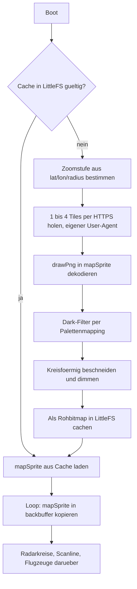

# OSM Dark-Map als Radar-Hintergrund

## Zielhardware

- MCU: ESP32-S3FH4R2 (ESP32-S3 Mini), 4 MB Flash und 2 MB QSPI-PSRAM im Chippaket, 512 KB internes SRAM
- Display: AZDelivery GC9A01, 1,28 Zoll rund, 240x240, 4-Draht-SPI, **3,3 V** für Logik und Versorgung
- Eingabe: KY-040 Drehencoder, WS2812-Status-LED auf dem Board

Das Speicherbudget geht damit auf: Karten-Sprite und Backbuffer je 240 * 240 * 2 = 115 KB, zusammen 230 KB in den 2 MB PSRAM, plus rund 45 KB Heap für TLS beim Tile-Download im internen SRAM.

## Ausgangslage und die drei Vorbedingungen

Drei Dinge mussten vor dem eigentlichen Feature geradegezogen werden, sonst funktioniert es prinzipiell nicht. Alle drei sind inzwischen erledigt und auf der Hardware verifiziert.

**PSRAM-Speichertyp.** *(Annahme widerlegt, siehe Schritt 1)* Der FH4R2 hat 2 MB QSPI-PSRAM, und ohne PSRAM gibt es keinen Platz für zwei 16-Bit-Sprites. Die Annahme war, dass das `esp32-s3-devkitc-1`-Profil per Default von Octal-PSRAM ausgeht und deshalb ein `PSRAM ID read error` auftritt. Für `espressif32@7.0.1` stimmt das nicht: das Board-Manifest enthält weder `memory_type` noch `psram_type`, und `_get_board_memory_type` in `builder/main.py` bildet den Default aus `flash_mode` plus `psram_type`, hier also aus `qio` und dem eingebauten Default `qspi`. Ein `envdump` der alten Konfiguration löst nachweislich ebenfalls auf `tools/sdk/esp32s3/qio_qspi` auf. Der Speichertyp war damit schon vorher richtig; die Zeilen aus Schritt 1 machen ihn nur explizit. Meldet die Boot-Diagnose trotzdem 0 Byte PSRAM, liegt die Ursache woanders und die Rückfallebene aus dem Abschnitt Risiken greift.

**Die Hintergrundbeleuchtung war abgeschaltet.** *(erledigt in Schritt 2)* [include/LGFX.h](include/LGFX.h) setzte `cfg.pin_bl = -1`, das AZDelivery-Modul hat aber einen BLK-Pin, der angesteuert werden muss. Bleibt er offen, ist das Display dunkel.

**Die aktuelle Projektion war nicht kartenkompatibel.** *(erledigt in Schritt 3 und 8)* `AircraftManager::ProjectCoordinateToScreen` rechnet äquidistant und ohne cos(lat)-Korrektur:

```370:381:src/AircraftManager.cpp
std::pair<int, int> AircraftManager::ProjectCoordinateToScreen(float predLat, float predLon) const
{
    const float dLon = predLon - lon;
    const float dLat = predLat - lat;

    const float normLon = (dLon + rad) / (2.0f * rad);
    const float normLat = (dLat + rad) / (2.0f * rad);
```

Auf 52 Grad Nord ist das Bild damit horizontal um Faktor 1/cos(52 Grad) = 1,62 gestreckt. Kartentiles sind Web Mercator. Ohne Umstellung würden Flugzeuge um bis zu 60 Prozent neben ihrer Position auf der Karte liegen. Die Umstellung ist gleichzeitig ein Bugfix, verschiebt aber sichtbar die Flugzeugpositionen.

## Datenfluss



## Schritt 1: Board-Konfiguration — erledigt

[platformio.ini](platformio.ini) enthält jetzt die für den FH4R2 dokumentierten Werte:

```ini
board_upload.maximum_size = 4194304
board_build.arduino.memory_type = qio_qspi
board_build.flash_mode = qio
board_build.psram_type = qspi
board_build.filesystem = littlefs
board_upload.after_reset = watchdog_reset
```

`huge_app.csv` bleibt: 3 MB App plus eine 896 KB grosse Datenpartition (`spiffs, 0x310000, 0xE0000`) — mehr als genug für den 115 KB grossen Cache. `monitor_port`/`upload_port` sind entfernt, PlatformIO erkennt den Port selbst; der harte `COM16` steht nicht mehr im Repo.

`board_upload.after_reset` ist nachträglich dazugekommen und behebt einen Fehler, der wie eine kaputte Firmware aussieht: Der FH4R2 spricht über sein USB-Serial-JTAG-Peripheral, und der von PlatformIO per Default angehängte `--after hard_reset` holt den Chip dort nicht aus dem Download-Modus. Nach einem `pio run -t upload` blieb das Board deshalb im Bootloader stehen — Display dunkel, Serial stumm, obwohl der Flash-Vorgang mit "Hash of data verified" endete. `watchdog_reset` löst den Reset über den RTC-Watchdog aus und startet die Anwendung tatsächlich. PlatformIO liest den Wert in `builder/main.py` über `board.get("upload.after_reset", "hard_reset")`, ist also mit dieser einen Zeile umgestellt.

Der bisher fest verdrahtete `#define RGB_LED_PIN 21` aus [src/main.cpp](src/main.cpp) ist als Build-Flag `-DRGB_LED_PIN=21` hinterlegt. "ESP32-S3 Mini" ist kein eindeutiges Produkt: je nach Hersteller sitzt die WS2812 auf GPIO21, GPIO47 oder GPIO48. Als Flag ist das eine Zeile in der `platformio.ini` statt einer Codeänderung, falls die LED dunkel bleibt. Die Status-LED ist rein kosmetisch, blockiert also nichts.

Abweichung: das `#define` in `main.cpp` wurde nicht gelöscht, sondern in einen `#ifndef`-Block gesetzt. Damit bleibt die Datei auch ohne das Build-Flag übersetzbar, das Flag gewinnt aber, wenn es gesetzt ist.

## Schritt 2: Display-Bring-up — erledigt

**Backlight per PWM.** In [include/LGFX.h](include/LGFX.h) ist der `Light_PWM`-Block scharf geschaltet:

```cpp
auto cfg = _light.config();
cfg.pin_bl = 1;          // BLK des GC9A01
cfg.freq   = 12000;
cfg.pwm_channel = 7;
cfg.invert = false;
```

GPIO1 ist auf dem FH4R2 frei und PWM-fähig. Belegt sind bereits GPIO2 bis GPIO6 für das Display und GPIO7 bis GPIO9 für den Encoder; GPIO33 bis GPIO37 sind beim FH4R2 tabu, weil dort das interne PSRAM hängt. Damit lässt sich die Helligkeit über `tft.setBrightness(0..255)` regeln, was gut zur Karten-Dimmung passt: die dunkle Karte bestimmt den Kontrast im Bild, die Beleuchtung die absolute Helligkeit im Raum.

In `setup()` wird die Helligkeit nach `tft.init()` auf die Konstante `DEFAULT_BACKLIGHT` (255) gesetzt. Die ist der Anknüpfungspunkt für den `backlight`-Slider aus Schritt 9. Die beiden auskommentierten Zeilen `pinMode(3, OUTPUT)` / `digitalWrite(3, HIGH)` sind bei der Gelegenheit entfallen.

**Boot-Diagnose.** `PrintBootDiagnostics()` in [src/main.cpp](src/main.cpp) gibt Chipmodell, Revision, Kernzahl, Flash-, PSRAM- und Heap-Größe aus und warnt explizit, wenn PSRAM 0 meldet. Dann ist die Konfiguration aus Schritt 1 nicht angekommen — das ist der Punkt, an dem das Feature sonst still scheitert.

Abweichung: statt des auskommentierten `delay(1000)` wartet `setup()` jetzt maximal 1 Sekunde auf den USB-CDC-Host und bricht ab, sobald er da ist. Ohne das schluckt CDC die Diagnose beim ersten Boot regelmäßig. Preis: hängt das Gerät an einer reinen Stromquelle ohne Terminal, kostet jeder Boot eine zusätzliche Sekunde. Bei einem Gerät, das danach ohnehin auf WiFi wartet, vertretbar — falls störend, ist die Schleife eine Zeile.

**Verdrahtung korrigieren.** Die Tabellen in [README.md](README.md) führten VCC auf 5 V. Das AZDelivery-Modul ist mit 3,3 V spezifiziert, Logik und Versorgung. Beide Tabellen stehen jetzt auf 3V3, die Display-Tabelle hat eine BLK-Zeile auf GP1 und einen Warnhinweis. Sollstand:

- Display: SCL an GPIO2, SDA an GPIO3, DC an GPIO4, CS an GPIO5, RES an GPIO6, BLK an GPIO1, VCC an 3,3 V, GND an GND
- Encoder: CLK an GPIO9, DT an GPIO8, SW an GPIO7, Plus an 3,3 V, GND an GND

Offen geblieben: `Images/Circuit.png` und `Images/Schematic.png` zeigen weiterhin die alte 5-V-Verdrahtung ohne BLK und widersprechen damit der Tabelle.

**Build verifiziert, Hardware noch nicht.** PlatformIO Core 6.1.19 liegt unter `C:\Users\SCH_JUL2\.platformio\penv\Scripts\platformio.exe`. Der erste Build zieht `espressif32@7.0.1` mit Arduino-Core 2.0.17 und läuft durch: RAM 15,8 Prozent (51.808 von 327.680 Byte), Flash 38,3 Prozent (1.206.377 von 3.145.728 Byte). Damit sind beide offenen Compile-Fragen beantwortet — `cfg.pwm_channel` heisst in der eingebundenen LovyanGFX-Version so, und die PSRAM-Flags werden akzeptiert. Der Build bindet nachweislich `tools/sdk/esp32s3/qio_qspi` ein, dessen `sdkconfig.h` `CONFIG_SPIRAM=1` zusammen mit `CONFIG_SPIRAM_MODE_QUAD=1` setzt — genau die Konfiguration, die der FH4R2 braucht.

Korrektur an Schritt 1: `board_build.psram_type` stand auf `qio`. Das ist ein Flash-, kein PSRAM-Busmodus. Der Wert speist in `builder/main.py` ausschliesslich den Default für `memory_type` (`flash_mode` plus `_` plus `psram_type`); solange `board_build.arduino.memory_type = qio_qspi` explizit gesetzt ist, gewinnt dieses. Fiele die Zeile jemals weg, hätte `qio` auf den nicht existierenden SDK-Ordner `qio_qio` gezeigt. Der Wert steht jetzt auf `qspi`.

**Auf der Hardware verifiziert.** Das Board meldet sich als COM3 mit VID:PID 303A:1001, esptool identifiziert es als ESP32-S3 (QFN56) rev v0.2 mit "Embedded Flash 4MB (XMC), Embedded PSRAM 2MB (AP_3v3)", eFuse-Flashtyp `quad`, USB-Modus USB-Serial/JTAG. Damit ist die Zielhardware bestätigt: 2 MB PSRAM am Quad-Bus, also `qio_qspi`, keine Octal-Variante.

Die Boot-Diagnose der laufenden Firmware:

```
rst:0x15 (USB_UART_CHIP_RESET),boot:0x8 (SPI_FAST_FLASH_BOOT)
Chip: ESP32-S3 rev 0, 2 core(s)
Flash: 4194304 bytes
PSRAM: 2095103 bytes (2095103 free)
Heap: 326680 bytes free
```

PSRAM läuft also mit 2.095.103 Byte frei — die 230 KB für Karten-Sprite und 16-bpp-Backbuffer aus dem Speicherbudget sind damit unkritisch, und die Rückfallebene mit dem 8-bpp-Palettensprite ist nicht nötig. Der freie Heap von 326 KB deckt die rund 45 KB für TLS beim Tile-Download mit grossem Abstand.

Kein Widerspruch, obwohl es so aussieht: Der ROM-Bootloader meldet `mode:DIO`, während `board_build.flash_mode` auf `qio` steht. `_get_board_flash_mode` in `builder/main.py` bildet `qio` absichtlich auf `dio` ab, weil nur der Image-Header betroffen ist; der Second-Stage-Bootloader schaltet danach auf QIO um. Der Wert in der `platformio.ini` bleibt richtig.

**Das Display ist verdrahtet und läuft.** Das Panel leuchtet und zeigt den Boot-Screen mit dem grünen "Connecting to WiFi..." lesbar an. Damit sind auf einen Schlag mehrere Annahmen bestätigt: BLK liegt tatsächlich auf GPIO1 und die PWM-Beleuchtung aus Schritt 2 greift, die SPI-Verdrahtung auf GPIO2 bis GPIO6 stimmt, und `setRotation(2)` plus `invertDisplay(true)` ergeben ein richtig orientiertes Bild. Ein Hängen im SPI-Init ist ebenfalls ausgeschlossen, weil die WiFi-Ausgaben nach `tft.init()` weiterlaufen.

Nebenbeobachtung: Mit verdrahtetem Display meldet der ROM-Bootloader `boot:0x2b` statt `boot:0x8`. Beides ist `SPI_FAST_FLASH_BOOT`; der Unterschied kommt daher, dass GPIO3 — jetzt SDA — beim ESP32-S3 ein Strapping-Pin für die JTAG-Quelle ist. Für den Betrieb ohne JTAG-Debugger ist das ohne Folgen, erklärt aber den geänderten Wert im Log.

**Die Boot-Diagnose am Monitor abzugreifen ist nicht trivial** und hat mehrere Anläufe gekostet, deshalb hier das funktionierende Verfahren. Zwei Fallstricke: Erstens wird `Serial` bei der USB-Serial-JTAG schon true, sobald der USB-Bus enumeriert ist, nicht erst wenn ein Terminal den Port öffnet — die Warteschleife bricht also ab und die Diagnose läuft ins Leere, bevor `pio device monitor` verbunden ist. Deshalb hängt hinter der Schleife jetzt ein `delay(1500)`, das nur greift, wenn tatsächlich ein Datenhost dranhängt; an einem reinen USB-Netzteil wird `Serial` nie true und der Boot bleibt schnell. Zweitens überlebt ein bereits offener Port-Handle den Reset nur, wenn das USB-Gerät nicht neu enumeriert: Der Reset über die RTS-Leitung tut das nicht, der Watchdog-Reset von esptool dagegen doch. Zuverlässig ist damit nur: Port öffnen, danach per RTS resetten und mitlesen. Wichtig dabei, DTR low zu lassen — das Peripheral bildet DTR auf IO0 ab, und pyserial aktiviert beim Öffnen per Default beide Leitungen, was den Chip in den Download-Modus schickt statt in die Anwendung.

## Schritt 3: Web-Mercator-Helper — erledigt

Neu: [include/WebMercator.h](include/WebMercator.h) mit reinen Funktionen, kein State:

- `double LonToWorldPx(double lon, int zoom)` und `double LatToWorldPx(double lat, int zoom)` nach der Standard-Slippy-Map-Formel (Welt = 256 * 2^zoom Pixel)
- `int SelectZoom(double lat, double radiusDeg)`: der Bildschirm soll genau 2 * radius Breitengrade zeigen. Aus `240 = 2 * rad * 256 * 2^z / (360 * cos lat)` folgt `2^z = 168.75 * cos(lat) / rad`; davon `round(log2(...))`, geklemmt auf 2 bis 16.
- `double EffectiveRadius(double lat, int zoom)`: der Kehrwert davon. Der Radius wird also auf die gewählte Zoomstufe eingerastet, damit die Tiles 1:1 ohne Resampling gezeichnet werden können. Bei Radius 0,2 auf 52 Grad Nord ergibt das z=9 und einen effektiven Radius von 0,2029 Grad, also gut 45 km Bildbreite — eine Abweichung von 1,5 Prozent.

Dazu kommen `ClampLatitude` und `WorldSize` als Bausteine. Die Klemmung auf 85,05112878 Grad ist nicht kosmetisch: bei Breitengraden nahe 90 divergiert der Logarithmus, und `radius = 0` würde ohne Abfangen eine Division durch null erzeugen.

**Die 1,5 Prozent sind ein Sonderfall, keine Eigenschaft.** Weil die Zoomstufe ganzzahlig ist, springt der effektive Radius zwischen zwei Stufen um den Faktor 2; die Abweichung liegt damit im ungünstigsten Fall zwischen -29,3 und +41,4 Prozent. Über ein Raster realistischer Standorte und Radien gemessen sind es -25,3 bis +35,3 Prozent. Für die reine Anzeige ist das unkritisch, es verschiebt aber über Schritt 8 auch die OpenSky-Bounding-Box und damit, welche Flugzeuge überhaupt geholt werden. Wer das nicht will, müsste die Tiles skalieren statt den Radius einzurasten — das kostet Rechenzeit und Bildqualität.

**Verifiziert.** Die Implementierung stimmt über 1309 Stützstellen von z0 bis z16 auf 4,3e-8 Pixel mit einer unabhängig aufgeschriebenen EPSG:3857-Variante über Meter (`R * ln(tan(pi/4 + phi/2))`) überein; die Anker (Äquator, Datumsgrenze, Polkappen-Klemmung) sitzen exakt und die Welt kommt quadratisch heraus. `2 * EffectiveRadius` spannt den Viewport über dasselbe Raster auf 0,64 von 240 Pixeln genau auf — der Rest ist Mercators Nichtlinearität über die Bildhöhe. Der Header übersetzt mit dem Xtensa-Compiler unter `-Wall -Wextra` warnungsfrei, und zwei Übersetzungseinheiten lassen sich zusammenlinken. Deshalb `inline` statt des im Projekt sonst genutzten `static`: Schritt 5 und Schritt 8 binden den Header aus mehreren Dateien ein.

## Schritt 4: Binärer HTTP-GET mit eigenem User-Agent — erledigt

[src/HttpRequestManager.h](src/HttpRequestManager.h) kannte nur `String`-Antworten, die ein PNG am ersten Nullbyte abschneiden. Dazu ist jetzt die geplante Signatur gekommen:

`HttpResult GetToBuffer(const String& url, uint8_t** outData, size_t* outLen, const String& userAgent)`

Bei Erfolg hält `*outData` genau `*outLen` Bytes und gehört dem Aufrufer, der ihn mit `free()` freigibt; im Fehlerfall bleiben beide auf `nullptr` und 0, sodass ein vergessener Fehlercheck nicht in einen Zufallszeiger läuft. Gelesen wird wie geplant über `getStreamPtr()` und `read()` in einen `heap_caps_malloc(..., MALLOC_CAP_SPIRAM)`-Puffer.

Der User-Agent ist keine Kosmetik, sondern Pflicht: die OSM-Tile-Policy blockt Library-Defaults. Deshalb ein identifizierender Wert wie `flight-radar/1.0 (+https://github.com/SchmidtJu/flight-radar)`; er ist als Parameter ohne Default ausgelegt, damit ihn niemand versehentlich weglässt. Aus demselben Grund fällt LovyanGFX' `drawPngUrl()` aus — es baut intern einen eigenen `HTTPClient` ohne UA-Möglichkeit.

Vier Dinge kamen beim Umsetzen dazu:

**Ein eigener `HTTPClient` statt des Members.** `HTTPClient` behält User-Agent, Timeouts und Redirect-Policy über Requests hinweg. Liefe der Tile-Download über das geteilte `http`-Member, trüge der nächste OpenSky-Request den Tile-User-Agent. Ein lokales Objekt kostet nur die weggefallene Verbindungswiederverwendung, und die greift bei vier einmaligen Requests an einen anderen Host ohnehin nicht.

**Antworten ohne Content-Length.** `getSize()` liefert bei einer Chunked-Antwort -1. Der Puffer startet dann bei 8 KB und wächst per `heap_caps_realloc` in 8-KB-Schritten, begrenzt auf 512 KB. Ein Tile liegt bei 10 bis 40 KB, die Grenze fängt also nur eine ausufernde Antwort ab — etwa eine HTML-Fehlerseite.

**Abbruchbedingungen.** `HTTPClient::connected()` meldet noch true, solange Daten gepuffert sind, taugt also als Ende-Erkennung erst zusammen mit einem leeren Puffer. Dazu ein Stall-Timeout von 8 Sekunden, damit eine hängende Verbindung nicht den Boot blockiert, und eine Prüfung auf unvollständigen Body: kommen weniger Bytes als angekündigt, ist das ein Fehler und kein halbes Tile.

**Statusprüfung auf genau 200.** Der bestehende `Get()` behandelt jeden Code über null als Erfolg — für einen Dekoder wäre eine 403-Fehlerseite als PNG aber Müll. `GetToBuffer` akzeptiert nur `HTTP_CODE_OK`, alles andere wird mit Status geloggt und als Fehler zurückgegeben, was die 403-Rückfallebene aus dem Abschnitt Risiken bedient.

Nicht geändert, aber erwähnenswert: `HTTPClient::begin(url)` fällt bei einer `https`-URL intern auf `TLSTraits(nullptr)` zurück, verifiziert also kein Zertifikat. Für öffentliche Kartenbilder ist das vertretbar, und der bestehende OpenSky-Aufruf macht es genauso — dort mit Token im Spiel, was der unangenehmere Fall ist.

## Schritt 5: MapTileProvider — erledigt

Neu: [src/MapTileProvider.h](src/MapTileProvider.h) / [.cpp](src/MapTileProvider.cpp). Besitzt das `LGFX_Sprite mapSprite` (240x240, 16 bpp, `setPsram(true)`, 115 KB) und bietet `Initialise()`, `IsReady()` und `DrawTo(LGFX_Sprite& dst)`. Die Konfiguration liest es wie der `AircraftManager` über `configServer.GetStoredString("latitude"|"longitude"|"radius")`, damit es nur eine Quelle für Mittelpunkt und Radius gibt.

Fünf Entscheidungen, die im Plan noch offen waren:

**Das Origin liegt auf ganzen Weltpixeln.** `originX = floor(centreX - 120)` statt des exakten Bruchteils, und der Wert ist über `GetOriginX()` / `GetOriginY()` abrufbar. Damit kann Schritt 8 die Flugzeuge gegen genau dasselbe Origin projizieren; sonst stünden Karte und Flugzeuge bis zu einen Pixel gegeneinander versetzt, weil die Tiles nur auf ganzen Pixeln liegen können.

**Datumsgrenze und Pole.** Die Tilespalte wird mit `((tileX % tileCount) + tileCount) % tileCount` umgeschlagen, weil der Viewport bei Längengraden nahe 180 Grad über die Kante läuft und `tileX` dann negativ oder zu groß wird. Für Zeilen gilt das nicht: jenseits der Pole gibt es keine Tiles, dieser Teil des Viewports bleibt schwarz.

**Ein leerer Radius wird abgefangen.** `GetStoredString("radius").toDouble()` liefert bei unkonfiguriertem Gerät 0, und `SelectZoom(lat, 0)` würde auf Zoom 16 laufen — ein Kartenausschnitt von wenigen hundert Metern. Der Provider fällt deshalb auf 0,2 Grad zurück, denselben Wert, den der `AircraftManager` als Default trägt.

**`IsReady()` verlangt nur ein dekodiertes Tile.** Fällt eines von vier aus, ist die Karte lückenhaft, aber brauchbar; fällt alles aus, bleibt `ready` false und der Renderpfad zeichnet wie bisher auf Schwarz. Jeder Fehlschlag wird mit Tilekoordinate und Grund geloggt.

**Das Sprite wird nur einmal allokiert.** `Initialise()` prüft `getBuffer()`, bevor es `createSprite` aufruft. Der "Karte neu laden"-Button aus Schritt 9 kann die Methode damit erneut aufrufen, ohne 115 KB PSRAM zu verlieren.

Noch nicht integriert: Aufgerufen wird der Provider erst in Schritt 8, und der Dark-Filter aus Schritt 6 fehlt — aktuell landet die Karte also in Originalfarben im Sprite. Übersetzt ist der Code, auf dem Gerät ausgeführt noch nicht.

Ursprünglich geplanter Ablauf in `Initialise()`:

Ablauf in `Initialise()`:

1. Mittelpunkt in Weltpixel umrechnen, Viewport-Ecke ist `(cx - 120, cy - 120)`.
2. Benötigte Tiles bestimmen: `tx` von `floor((cx-120)/256)` bis `floor((cx+119)/256)`, analog `ty`. Bei 240 Pixeln sind das maximal 2x2, also vier Requests — genau der sichtbare Viewport, damit policy-konform.
3. Pro Tile `https://tile.openstreetmap.org/{z}/{x}/{y}.png` holen und mit `mapSprite.drawPng(data, len, destX, destY, 0, 0, offX, offY)` dekodieren. Bei negativer Zielposition nicht negativ zeichnen, sondern auf `offX = -destX; destX = 0` umrechnen, damit der Beschnitt sauber im Decoder passiert.
4. Nach dem letzten Tile den Puffer freigeben — TLS braucht rund 45 KB Heap, deshalb Tiles sequenziell und nicht parallel halten.

## Schritt 6: Dark-Filter, Beschnitt, Dimmung — erledigt und auf dem Gerät verifiziert

Standard-OSM-Tiles nutzen eine feste, bekannte Palette. Ein reines Invertieren sieht schlecht aus (Wald wird magenta, Wasser braun, und weisse Strassen werden dunkler als der Hintergrund). Umgesetzt ist deshalb wie geplant ein Nearest-Colour-Mapping, das in [include/MapDarkTheme.h](include/MapDarkTheme.h) als reine Funktion liegt. Gegenüber der Planliste sind vier Einträge dazugekommen — Ackerland, Industriegebiet, Secondary und das graue Casing von Strassen und Bahnlinien —, weil ohne sie grosse Flächen in die Fallback-Rampe gefallen wären.

Die Farbdistanz ist perzeptuell gewichtet, 2 zu 4 zu 3 auf R, G und B im Sinne von Rec. 601. Unweighted euklidisch verwechselt das rosa Autobahnband mit der beigen Primary. Liegt der beste Treffer weiter als 55 Einheiten pro Kanal entfernt, greift die geplante Luminanz-Rampe, und zwar invertiert: OSM zeichnet dunkle Schrift auf hellem Papier, das Dark-Theme braucht das Gegenteil. Nötig ist das selten — auf Zoom 8 laufen 1,2 Prozent der Pixel über die Rampe, auf Zoom 7 nur 0,1 Prozent.

**Entschieden wurde am Bild, nicht am Farbwert.** Der Filter wurde vor dem Flashen in Python auf denselben echten Tiles nachgerechnet und als Vorschau gegengeprüft, inklusive der RGB565-Quantisierung, die das Sprite den Farben antut (bis zu 4 Einheiten pro Kanal, gegen den Schwellenwert von 55 also vernachlässigbar). Das ist deutlich billiger als ein Flash-Zyklus pro Farbentscheidung. Aus diesem Vergleich kommen zwei Abweichungen vom Plan.

Erstens die Helligkeit: **Der geplante Default von 45 Prozent macht die Karte unbrauchbar.** Die Palette ist selbst bereits ein Dark-Theme; ein zweiter Dimmfaktor darüber löscht genau die Städtenamen und Strassen, die der Plan lesbar halten wollte. Der Default steht deshalb auf 100 Prozent. Der Faktor bleibt als Regler erhalten und wird aus dem NVS-Schlüssel `map-brightness` gelesen, den Schritt 9 im Panel anlegt. Ein leerer Wert fällt auf 100 zurück und alles unter 5 wird gekappt — `toInt()` liefert auf einer leeren Zeichenkette 0, und das wäre eine schwarze Karte.

Zweitens die Grüntöne: Wald, Wiese und Ackerland sind neutraler gehalten als eine getreue Umfärbung ergäbe. Zwei Gründe. OSM-Landnutzung ist stark gesprenkelt, was bei satten Grüntönen unruhig aussieht. Und Flugzeuge wie Scanline sind selbst grün, eine grüne Karte konkurriert also mit genau der Information, die obenauf liegen soll.

**Umsetzung im Provider.** Der Filter läuft zeilenweise über `readRectRGB` und `pushImage` statt über den Rohpuffer: 720 Byte Stack statt eines zweiten Vollbildpuffers, und die typisierten Overloads rechnen von und nach RGB565 um, ohne dass der Code eine Byte-Reihenfolge annehmen muss. Der Beschnitt auf Radius 119 passiert im selben Durchlauf.

Ein Sonderfall war nötig: reines Schwarz bleibt schwarz. Der Provider löscht das Sprite vor dem Download, und ein fehlgeschlagenes Tile lässt diese Fläche stehen. Über die invertierte Rampe wäre daraus das hellste Grau geworden — eine fehlende Kachel also der auffälligste Teil des Bildes.

Gemessen auf dem Gerät: `[MAP] dark theme applied at 100% brightness in 113 ms`, einmalig beim Boot. Flash und RAM bleiben bei 39,3 und 15,9 Prozent, der Filter ist reiner Code ohne zusätzlichen Puffer.

## Schritt 7: Cache in LittleFS — erledigt und auf dem Gerät verifiziert

`/map.raw`: 28 Byte Header plus 240 * 240 * 2 = 115.200 Byte RGB565, zusammen 115.228 Byte in der 896-KB-Datenpartition von `huge_app.csv`. Gespeichert wird die fertig nachbearbeitete Bitmap, ein Treffer überspringt also Download **und** Filter.

Diese 7 Tage sind kein willkürlicher Wert: die Tile Usage Policy fordert lokales Caching nach den HTTP-Headern beziehungsweise mindestens 7 Tage und verlangt ausdrücklich, dass wiederholte Ansichten nicht erneut geladen werden. Sie verbietet im selben Atemzug Offline-Nutzung als Funktion. Der Cache ist deshalb genau das: eine Vermeidung von Re-Downloads mit Verfall, kein Offline-Archiv — der ursprüngliche Planwortlaut "auch ohne Netz" war als Zielsetzung nicht zulässig und ist gestrichen.

**Verglichen werden abgeleitete Werte, nicht die Konfiguration.** Der Header führt Zoom, `originX` und `originY` statt lat/lon/radius. Das sind ganze Zahlen, es braucht also keine Fließkomma-Toleranz, und der Vergleich beantwortet die eigentliche Frage: zeigt die Datei dasselbe Bild? Am Gerät belegt: Der Radius wanderte von 0,8 auf 1,0 Grad, beides rastet auf Zoom 7 mit identischem Origin ein, und der Cache blieb gültig. Über die Rohwerte verglichen wären hier vier Kacheln ohne jeden sichtbaren Unterschied neu geholt worden. Helligkeit und Filterzustand stehen ebenfalls im Header, weil sie das gespeicherte Bild verändern; eine Helligkeit von 100 auf 80 verwirft den Cache prompt.

**Der Zeitstempel war das eigentliche Problem.** `configTime` steht wie geplant direkt nach dem WiFi-Connect, aber SNTP antwortete am Testgerät erst nach rund 14 Sekunden Uptime — deutlich nach dem Kartenaufbau. Der erste Cache wird also immer ohne Zeit geschrieben, und eine Datei ohne Zeitstempel könnte nie verfallen. Auf die Uhr zu warten würde genau die Bootzeit kosten, die der Cache einspart. Stattdessen merkt sich der Provider ein `cacheTimestampPending` und trägt die 4 Byte im Header nach, sobald der Hauptloop eine plausible Zeit sieht (`UpdateCacheTimestampWhenClockArrives`, im Log "cache timestamp written after 14183 ms of uptime"). Fehlt die Uhr dauerhaft, bleibt der Cache gültig: sieben Tage sind ein Minimum, keine Frist — und der Reload-Button existiert.

**Der Reload-Button löscht die Datei nicht,** wie im Plan vorgesehen, sondern `Initialise(true)` umgeht den Cache und überschreibt ihn danach. Ein Zustand weniger, gleiche Wirkung.

Gemessen: Laden aus dem Cache 41 bis 42 ms gegen rund 2,4 Sekunden für vier TLS-Downloads, Schreiben 378 bis 393 ms. Der Flash-Verbrauch steigt durch LittleFS von 39,5 auf 40,9 Prozent, das RAM bleibt bei 16,0 Prozent. `LittleFS.begin(true)` formatiert beim ersten Start selbst — die `Corrupted dir pair`-Fehlerzeilen der Bibliothek beim allerersten Boot sind genau das und danach verschwunden. Scheitert das Mounten, entfällt nur der Cache, nicht die Karte.

## Schritt 8: Integration in den Renderpfad — erledigt und auf dem Gerät verifiziert

Vorgezogen vor Schritt 6 und 7, aus einem Grund: Das grösste offene Risiko war eine 403-Antwort von `tile.openstreetmap.org`. Ein Dark-Filter für Farben, die vielleicht nie ankommen, wäre Arbeit auf Verdacht. Die Karte landet dadurch zunächst in Originalfarben auf dem Panel — hell und ohne Beschnitt, aber sichtbar, und das war der Punkt.

**Neu: [include/Viewport.h](include/Viewport.h).** Der Plan liess offen, wie der `AircraftManager` an Zoom und Origin des Providers kommt. Eine Referenz auf den Provider hätte den Flugzeugteil an den Tile-Downloader gekoppelt, ein Setter hätte eine Reihenfolge in `setup()` erzwungen, die niemand sieht. Stattdessen gibt es jetzt `MakeViewport(lat, lon, radius)`: eine reine Funktion, die aus der Konfiguration Zoom, Origin und eingerasteten Radius berechnet. Beide Seiten rufen sie auf derselben Konfiguration auf und kommen deshalb zwingend auf dasselbe Ergebnis, ohne sich zu kennen. Die `Viewport`-Struktur liefert zusätzlich die geografischen Kanten des Bildes über `LatMin`/`LatMax`/`LonMin`/`LonMax`. Der Rückfall auf 0,2 Grad bei unkonfiguriertem Radius sitzt ebenfalls dort, also nur an einer Stelle.

Dafür ist [include/WebMercator.h](include/WebMercator.h) um die beiden Umkehrfunktionen `WorldPxToLon` und `WorldPxToLat` gewachsen. Der Roundtrip lat/lon nach Weltpixel und zurück stimmt über Zoom 0 bis 16 und Breiten von -85 bis 85 Grad auf 1e-13 Grad.

**Die Bounding-Box war der eigentliche Fund.** Der Plan sagte nur, der eingerastete Radius solle verwendet werden. Tatsächlich war die alte Box grundfalsch: sie spannte `lat ± rad` **und** `lon ± rad`, also ein in Grad quadratisches Fenster. Unter Mercator ist das Bild in Längenrichtung aber um 1 / cos(lat) breiter als in Breitenrichtung. Nachgerechnet über die neuen Umkehrfunktionen:

| Breite | sichtbar (Längengrade) | alte Box | nicht abgefragt |
|---|---|---|---|
| 52,52 Grad | 0,65918 | 0,40110 | 39,2 Prozent |
| 60,00 Grad | 0,65918 | 0,32959 | 50,0 Prozent |
| 71,17 Grad | 1,31836 | 0,42552 | 67,7 Prozent |

Auf Berliner Breite wurden also 39 Prozent der Bildbreite nie bei OpenSky angefragt; Flugzeuge am linken und rechten Bildrand konnten gar nicht erscheinen. Die Box kommt jetzt direkt aus den Viewport-Kanten und deckt exakt das sichtbare Bild ab — geprüft über sieben Standorte, Abweichung zur Mercator-Erwartung unter 0,01 Prozent. Nebenbei sind die Koordinaten auf sechs Dezimalstellen erhöht: `String(double)` schreibt per Default zwei, was die Boxkante um bis zu 550 Meter verschob.

**Abweichung beim Backbuffer.** Der Plan wollte beide Sprites im PSRAM. Der Backbuffer wird aber jedes Frame komplett neu beschrieben, und internes SRAM ist dafür deutlich schneller und DMA-fähig. Er wird deshalb zuerst intern angelegt (115 KB von rund 326 KB) und fällt nur bei Fehlschlag auf PSRAM zurück, mit Logzeile. Das mapSprite liegt unverändert im PSRAM.

Ausserdem zeigt der Boot-Screen jetzt "Loading map...", weil vor dem ersten Bild bis zu vier TLS-Downloads laufen und das Gerät sonst hängengeblieben aussieht.

`ProjectCoordinateToScreen` rechnet wie geplant `LonToWorldPx(lon, zoom) - originX`, und die Radarkreise sind von 200/64/32 auf 220/110/80 Grün angehoben — die inneren beiden waren auf einem Kartenhintergrund praktisch unsichtbar.

**Ergebnis auf der Hardware.** Alle vier offenen Fragen sind beantwortet, in beiden Testläufen mit `[MAP] 4 of 4 tiles decoded`:

- Kein 403. OpenStreetMap akzeptiert den User-Agent aus Schritt 4, die Rückfallebene wurde nie gebraucht.
- `drawPng` dekodiert die Tiles in das PSRAM-Sprite, das Panel zeigt die Karte.
- Der Backbuffer passt ins interne SRAM; die PSRAM-Rückfallmeldung erschien nicht.
- Der Loop läuft mit rund 20 Bildern pro Sekunde (49 ms pro Durchlauf, gemessen an den Log-Zeitstempeln), also unverändert gegenüber dem reinen `fillScreen`.

Die Bounding-Box-Korrektur ist dabei am Livesystem sichtbar geworden. Für Landsberg am Lech mit Radius 0,5 loggt das Gerät `zoom 8, effective radius 0.4407, box 47.60987..48.49113 / 10.21729..11.53564`: 0,88 Grad Breite gegen 1,32 Grad Länge. Das Verhältnis 1,50 ist exakt 1 / cos(48,05 Grad), die Box deckt also genau das sichtbare Bild ab. Die alte quadratische Box hätte hier links und rechts je 16 Prozent verworfen.

Zwei Nebenbefunde aus dem Log, beide keine Fehler dieses Features: Ohne konfigurierte Position greift der Rückfall auf 0,2 Grad, was das Gerät auf 0/0 in den Atlantik zeigt — sichtbar als leere Wasserfläche, nicht als Absturz. Und `Preferences` protokolliert für jeden ungesetzten Schlüssel eine `NOT_FOUND`-Zeile auf Error-Level, bei `scanline` einmal pro Frame. Das flutet den seriellen Log, solange die Konfiguration leer ist.

## Schritt 9: Web-Panel, Rotation und Attribution — erledigt und auf dem Gerät verifiziert

In [src/ConfigurationWebServer.cpp](src/ConfigurationWebServer.cpp) neben die bestehenden Checkboxen:

- `map` (Kartenhintergrund an/aus), `map-brightness` (0 bis 100) für die Dimmung des Kartenbilds
- `map-dark` (Dark-Filter an/aus), damit die Karte auch in Originalfarben laufen kann
- `flip` (Anzeige um 180 Grad drehen), damit das Panel auch kopfüber eingebaut werden kann
- `backlight` (0 bis 100) für die neue PWM-Hintergrundbeleuchtung aus Schritt 2
- Anzeige der gewählten Zoomstufe und des effektiven Radius, damit das Einrasten nachvollziehbar ist
- Ein "Karte neu laden"-Button, der die Cache-Datei löscht
- Die Zeile `Map data (c) OpenStreetMap contributors` — die ODbL-Attribution ist verpflichtend. Zusätzlich kurz auf dem Boot-Screen und in [README.md](README.md).

**Rotation.** `tft.setRotation(2)` steht in [src/main.cpp](src/main.cpp) fest; kopfüber ist dasselbe Bild `setRotation(0)`. Der Eingriff ist billig, weil LovyanGFX die Drehung nicht selbst rechnet, sondern über das MADCTL-Register im GC9A01 einstellt: sie gilt damit für alles, was danach ans Panel geht — Boot-Screen, Backbuffer und Kartensprite —, ohne dass eine einzige Zeichenroutine davon wissen muss. Der Drehencoder bleibt unberührt, seine Richtung hat mit der Panelorientierung nichts zu tun. Zwei Stufen genügen: bei einem runden Panel mit fest verbautem Encoder wären 90 oder 270 Grad nur Verwirrung.

**Der Filter-Toggle erzwingt eine Aufteilung.** `MapTileProvider::ApplyDarkTheme` macht bisher drei Dinge in einem Durchlauf: umfärben, dimmen, kreisförmig beschneiden. Abschalten darf der Toggle nur das Umfärben. Der Beschnitt muss bleiben, sonst ragen die Tile-Ecken in Bereiche, die hinter der Blende liegen, und die Dimmung ist unabhängig sinnvoll — eine Originalkarte auf 40 Prozent ist eine dritte brauchbare Optik. Die drei Stufen werden deshalb getrennt geschaltet.

Zu bedenken: Ein Umschalten des Filters kostet vier neue Tile-Downloads, weil das Sprite nur das Ergebnis hält und die Originalfarben darin nicht mehr existieren. Solange Schritt 7 fehlt, gilt das für jede Änderung an Position, Radius, Filter oder Helligkeit gleichermaßen; der `/save`-Handler startet das Gerät ohnehin neu. Kommt der Cache, muss dessen Header Filterzustand und Helligkeit mitführen, sonst zeigt das Gerät nach dem Umschalten weiter das alte Bild.

Zur Attribution im Zusammenspiel mit dem `map`-Toggle: Sie muss sichtbar sein, solange die Karte gezeichnet wird, und darf nicht selbst hinter einer Option verschwinden — die Tile Usage Policy verbietet Attribution ausdrücklich "behind toggles".

**Umgesetzt ist genau das, mit vier Punkten, die im Plan noch offen waren.**

*Der Filter ist jetzt dreistufig.* `ApplyDarkTheme` heisst `PostProcess` und trennt Umfärben (schaltbar), Dimmen und Beschnitt (beide immer). Dass die Stufen wirklich unabhängig sind, zeigt die Laufzeit auf dem Gerät: 114 ms mit Umfärben, 41 ms ohne.

*Der Reload-Button läuft nicht im Request.* Vier TLS-Downloads dauern rund 2,4 Sekunden, und der Handler des `AsyncWebServer` darf nicht blockieren, ohne den Server-Task lahmzulegen. `/reload-map` setzt deshalb nur ein Flag, das `ConsumeMapReloadRequest()` im Hauptloop einmalig abholt und dort abarbeitet, wo Blockieren erlaubt ist. Das Sprite wird dabei nicht neu allokiert, weil `Initialise()` seit Schritt 5 auf `getBuffer()` prüft.

*Die Rotation wird vor dem ersten Zeichnen gelesen.* `configServer.GetStoredString` funktioniert bereits, bevor `configServer.Initialise()` gelaufen ist — `Preferences` öffnet den NVS-Namespace selbst und hängt nicht am Webserver. Die Zeile steht damit direkt bei `tft.init()`, und weil die Drehung im MADCTL landet, gilt sie auch für den Boot-Screen.

*Attribution.* Sie stand zunächst dauerhaft klein am unteren Bildrand, gezeichnet als Letztes nach den Flugzeugen. **Auf Wunsch wieder aus dem laufenden Radarbild entfernt** — sie erschien im 240-Pixel-Rundbild als Störung. Sie bleibt damit auf dem Ladebildschirm, in der Fusszeile des Panels samt Lizenz- und "Report a map issue"-Link und in [README.md](README.md). Das ist eine bewusste Abweichung von der Policy, die Attribution "clearly on the map" verlangt: Für ein privates Gerät ohne Veröffentlichung vertretbar, für eine Weitergabe der Firmware wäre die Zeile im Bild wieder einzuschalten.

Ein Nebeneffekt, der die Diagnose erleichtert: Sobald einmal gespeichert wurde, sind alle Schlüssel gesetzt, und die `Preferences`-`NOT_FOUND`-Zeilen auf Error-Level verschwinden aus dem seriellen Log.

## Risiken und Rückfallebenen

- ~~Meldet die Boot-Diagnose trotz korrekter Flags 0 Byte PSRAM, ist die Rückfallebene ein 8-bpp-Palettensprite (57,6 KB)~~ — ausgeräumt, die Hardware meldet 2.095.103 Byte freies PSRAM.
- ~~Bleibt das Display nach Schritt 2 dunkel, liegt BLK physisch nicht auf GPIO1~~ — ausgeräumt, das Panel zeigt den Boot-Screen. Ob `setBrightness` wirklich dimmt oder das Modul BLK intern auf VCC zieht, zeigt erst der Slider aus Schritt 9.
- ~~Antwortet `tile.openstreetmap.org` mit 403, weil der User-Agent nicht akzeptiert wird, wird geloggt und auf das reine Radarbild zurückgefallen~~ — ausgeräumt, die Tiles kommen an. Die Rückfallebene bleibt im Code, falls die Policy sich ändert.
- Die Projektionsumstellung ändert sichtbar die Flugzeugpositionen gegenüber der aktuellen Firmware. Das ist beabsichtigt, sollte aber beim ersten Vergleich nicht überraschen.
- Bleibt die Status-LED dunkel, sitzt die WS2812 auf einem anderen GPIO als 21. Das ist über das Build-Flag aus Schritt 1 in einer Zeile korrigiert (typisch 47 oder 48).
- Hängt das Board nach einem Flash-Vorgang scheinbar tot am USB, ist es vermutlich im Download-Modus stehen geblieben. Ohne die `after_reset`-Zeile aus Schritt 1 passiert das bei jedem Upload. Herausholen lässt es sich mit `esptool.py --port COM3 --after watchdog_reset flash_id` oder durch kurzes Abziehen des USB-Kabels.
